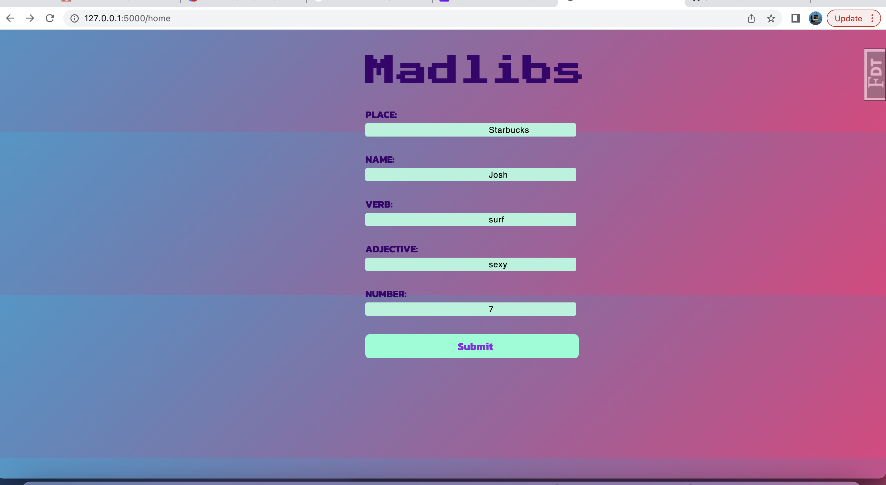
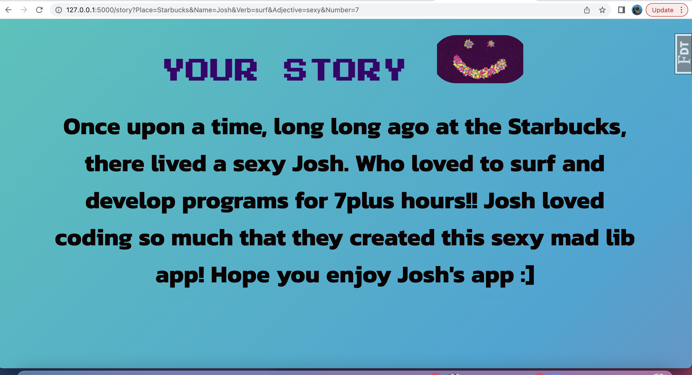

# Flask Mad libs App

## Overview

Build a Mad Lib App with incorporating different routes. A route with a form to submit some parameters, and using those parameters to plug into a story.

### Screenshot of solution:

### Built with

- Semantic HTML5 markup
- CSS custom properties
- Flexbox
- Flask
- Flask Virtual Environment

### What I learned

In this project I learned how to use flask routes, templates, Jinja conditionals, and to just become more comfortable with the Flask environment.

### Continued development

I will come back to this app and add a stories template where users can choose a story template, and have a different story each time. 

### Useful resources

- [StackOverflow](https://www.stackoverflow.com) - This helped me with alot of the CSS components, and how to better use flexbox.

## Author

- Website - [Josh Villanueva](https://www.linkedin.com/in/patrick-villanueva-850037a9/)

